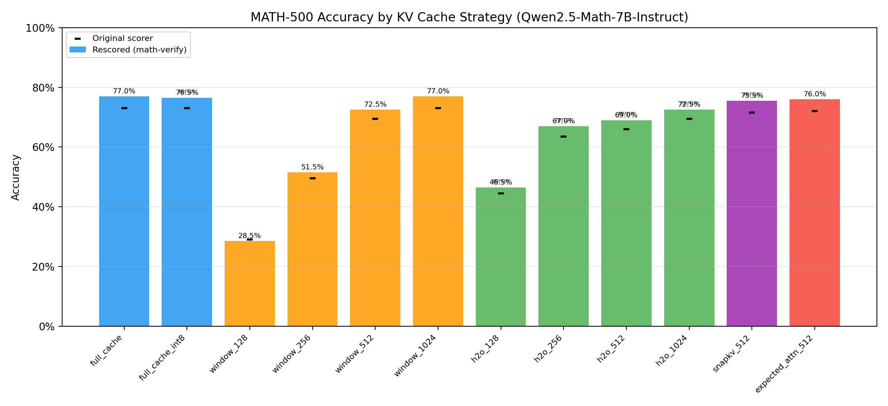
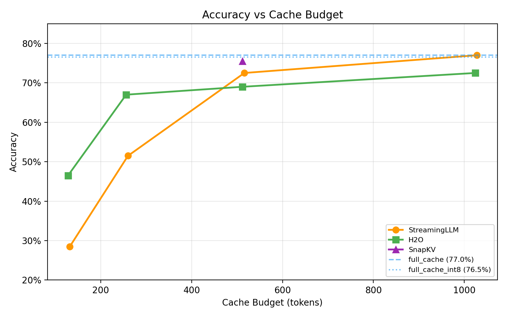

# Hardware Proprioception

Analytical roofline-based cost oracle for LLM inference on diverse hardware, with real accuracy evaluation of KV cache compression strategies.

## What this project does

LLM inference is memory-bound during decode. KV cache compression (evicting, quantizing, or offloading tokens) reduces memory pressure but can hurt accuracy. This project answers:

**At a given memory budget, does it matter *how* you choose which tokens to keep?**

It has two independent pipelines:

1. **Accuracy pipeline** — Runs real LLM generation on MATH-500 problems with 12 concrete KV cache strategies via [kvpress](https://github.com/simonask/kvpress). Measures whether the model still gets the right answer after cache compression.

2. **Latency pipeline** — Post-hoc roofline simulation that computes per-token decode latency for each strategy across 16 hardware configs. No GPU needed.

## Results

Full 200-task MATH-500 eval on Qwen2.5-Math-7B-Instruct, rescored with `math-verify` for symbolic equivalence:

| Strategy | Accuracy | Budget (tokens) |
|---|---|---|
| `full_cache` | 77.0% | unlimited |
| `full_cache_int8` | 76.5% | unlimited (INT8 HQQ) |
| `window_1024` | 77.0% | 1028 |
| `expected_attn_512` | 76.0% | 512 |
| `snapkv_512` | 75.5% | 512 |
| `window_512` | 72.5% | 516 |
| `h2o_1024` | 72.5% | 1024 |
| `h2o_512` | 69.0% | 512 |
| `h2o_256` | 67.0% | 256 |
| `window_256` | 51.5% | 260 |
| `h2o_128` | 46.5% | 128 |
| `window_128` | 28.5% | 132 |




**Key findings:**
- INT8 HQQ quantization is essentially free (76.5% vs 77.0% ceiling)
- SnapKV at 512 tokens (75.5%) nearly matches full cache — best compression/accuracy tradeoff
- At equal budgets, H2O underperforms StreamingLLM (eager attention requirement may affect scoring)
- All strategies converge toward ceiling at 1024 token budget

Raw data and plots in `results/`.

## Architecture

```
src/hwprop/
  specs.py          # 16 hardware configs, 14 model configs, memory tier specs
  cost_model.py     # Stateless roofline math: (hardware, model, kv_state) -> StepCost
  oracle.py         # Stateful RL interface: step(), reset(), budget tracking
  eval_pipeline.py  # Synthetic eval + latency replay helpers
  accuracy_eval.py  # Real accuracy eval with kvpress strategies
  sampling.py       # Synthetic hardware sampling for training
```

**Key design decisions:**
- All internal values in **bytes** and **FLOPS/s** (not GB or TFLOPS)
- Roofline: `wall_clock = max(hbm_time, compute_time) + cpu_transfer + disk_transfer`
- 3 memory tiers: HBM, CPU (DDR), Disk (NVMe) — transfers are additive (blocking)
- Dense models only (MoE deferred)

## Installation

```bash
# Core package (cost model + oracle)
pip install -e ".[dev]"

# With real accuracy eval (requires GPU)
pip install -e ".[accuracy]"
```

## Running the Evaluation

### Smoke test

```bash
python scripts/smoke_test_kvpress.py
```

### Real accuracy eval (requires GPU)

```bash
# Quick test
python scripts/eval_accuracy.py --num-tasks 3 --strategies full_cache,window_512

# Full run (200 problems, all 12 strategies)
python scripts/eval_accuracy.py --num-tasks 200

# Split across GPUs
CUDA_VISIBLE_DEVICES=0 python scripts/eval_accuracy.py --num-tasks 200 \
  --strategies full_cache,full_cache_int8,window_128,window_256,window_512,window_1024
CUDA_VISIBLE_DEVICES=1 python scripts/eval_accuracy.py --num-tasks 200 \
  --strategies h2o_128,h2o_256,h2o_512,h2o_1024,snapkv_512,expected_attn_512
```

### Post-hoc rescoring

```bash
python scripts/rescore_with_math_verify.py results/accuracy_results_final.jsonl --compare
```

### Latency simulation (no GPU needed)

```bash
python scripts/eval_naive_strategies.py --hardware H100_SXM --model LLaMA-3.1-8B
```

## Hardware Catalog

16 hardware configs spanning datacenter GPUs, TPUs, and edge devices:

**NVIDIA:** A100 80GB, H100 SXM, H200, B200, B300, L40S, RTX 5090
**AMD:** MI300X, MI325X, MI350X
**Google:** TPU v5e, TPU v6e, TPU v7
**Intel:** Gaudi 3 | **Apple:** M4 Max | **Qualcomm:** Snapdragon X Elite

## Tests

```bash
pytest tests/ -q
```

125 tests covering cost model, oracle, eval pipeline, accuracy scoring, and strategy registry.

## Project Structure

```
hardware-proprioception/
  src/hwprop/           # Core package
  tests/                # Test suite (125 tests)
  scripts/              # Eval runners, plotting, rescoring
    eval_accuracy.py
    eval_naive_strategies.py
    smoke_test_kvpress.py
    plot_accuracy_results.py
    rescore_with_math_verify.py
  results/              # Final eval outputs (plots + JSONL)
  pyproject.toml
```
